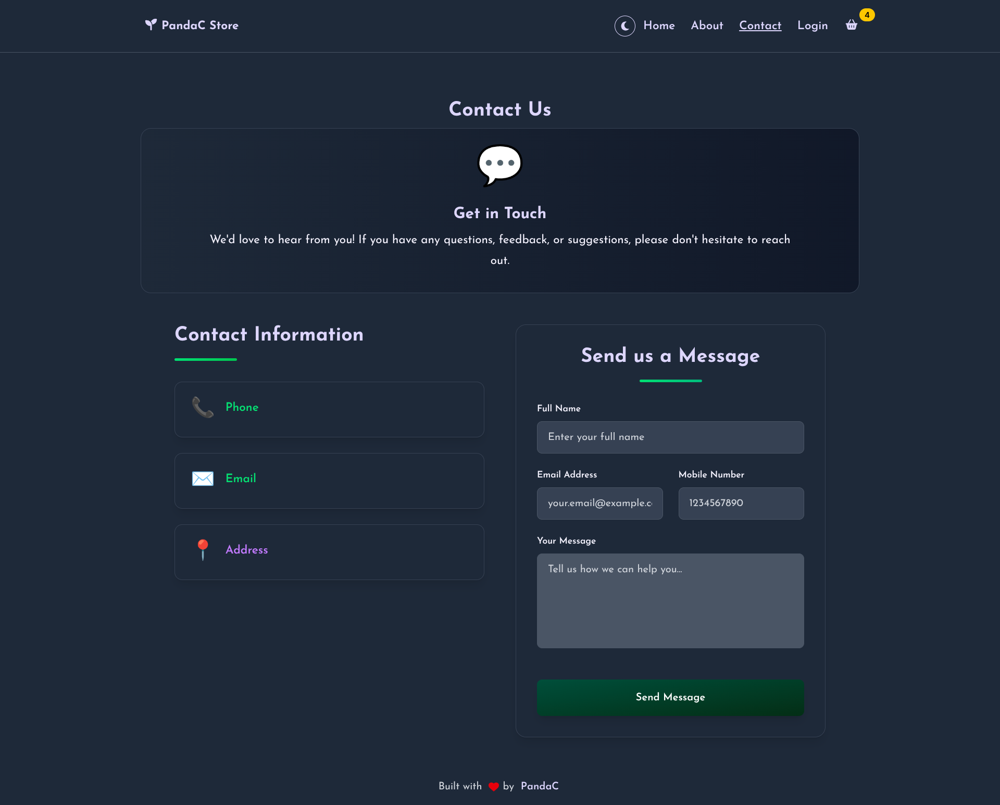

# Pandac Store

A full-stack e-commerce application for plant enthusiasts, built with modern technologies and containerized for easy deployment.


## 🌱 About

Pandac Store is a complete e-commerce platform specializing in plants and gardening products. It features a React frontend, Spring Boot backend, MySQL database, nginx reverse proxy, and integrated payment processing with Stripe.

## 🏗️ Architecture

```text
┌─────────────────┐    ┌─────────────────┐    ┌─────────────────┐    ┌─────────────────┐
│     Client      │    │  Nginx Proxy    │    │    Backend      │    │    Database     │
│   (Browser)     │────│  (Port: 80)     │────│  (Spring Boot)  │────│     (MySQL)     │
│                 │    │                 │    │   Port: 8080    │    │   Port: 3306    │
└─────────────────┘    └─────────────────┘    └─────────────────┘    └─────────────────┘
                              │
                              │
                    ┌─────────────────┐
                    │   Frontend      │
                    │   (React/Nginx) │
                    │   Port: 80      │
                    └─────────────────┘
```

## ⚡ Quick Start

1. **Validate your environment**:

   ```bash
   ./scripts/validate-setup.sh
   ```

2. **Configure environment variables**:

   ```bash
   cp .env.example .env
   # Edit .env file with your actual API keys
   ```

3. **Verify configuration**:

   ```bash
   ./scripts/check-tokens.sh
   ```

4. **Start the application**:

   ```bash
   docker-compose up -d
   ```

5. **Access the application**:

   - **Application**: <http://localhost> (Single entry point via nginx)
   - **API Endpoint**: <http://localhost/api/v1>
   - **Database**: localhost:3306 (for admin access only)

## 🛠️ Tech Stack

### Infrastructure

- **Nginx Reverse Proxy** - Single entry point, CORS handling, static file serving
- **Docker & Docker Compose** - Container orchestration
- **Multi-stage builds** - Optimized container images

### Frontend

- **React 19** with modern hooks
- **Vite** for fast development and building
- **Tailwind CSS** for responsive styling
- **Redux Toolkit** for state management
- **Stripe Elements** for secure payments
- **Centralized API Configuration** - Single source of truth

### Backend

- **Spring Boot 3.5** with Java 21
- **Spring Security** with JWT authentication
- **Spring Data JPA** with Hibernate
- **Flyway** for database migrations
- **Stripe API** for payment processing
- **MySQL 8.0** database

### DevOps & Configuration

- **Environment-based configuration** with Docker
- **Health checks** for service monitoring
- **Centralized API endpoint management**
- **Production-ready reverse proxy setup**

## Documentation

For detailed documentation, see:

- [Docker Setup](docs/DOCKER.md) - Complete Docker setup and deployment guide
- [Nginx Proxy Configuration](docs/NGINX_PROXY.md) - Reverse proxy setup and configuration
- [API Configuration Management](docs/API_CONFIG.md) - Centralized configuration system
- [Image Upload API](docs/IMAGE_UPLOAD_API.md) - Product image management  
- [Discount API](docs/DISCOUNT_API.md) - Discount and promotion system

## Development

### Prerequisites

- Docker & Docker Compose
- Git
- Your favorite code editor

### Environment Setup

1. **Stripe API Keys**: Get from [Stripe Dashboard](https://dashboard.stripe.com/apikeys)
2. **GitHub Token**: Create at [GitHub Settings](https://github.com/settings/tokens)
3. **Update .env file** with real values

### API Configuration

The application uses a **centralized configuration system**:

- **Single Source**: `/pandac-store-ui/src/config/api.js`

```javascript
// pandac-store-ui/src/config/api.js
export const API_BASE_URL = '/api/v1';  // ← Change here only!
export const API_TIMEOUT = 10000;
```

### Common Commands

```bash
# Start all services (single command!)
docker-compose up -d

# View logs
docker-compose logs -f

# View specific service logs
docker-compose logs -f nginx
docker-compose logs -f frontend
docker-compose logs -f backend

# Restart a service
docker-compose restart nginx

# Stop everything
docker-compose down

# Clean rebuild (if you change configuration)
docker-compose down -v --rmi all
docker-compose up --build

# Check service status
docker-compose ps
```

### Service URLs (Internal Development)

- **Application**: <http://localhost> (nginx proxy)
- **API Direct**: <http://localhost/api/v1/*>
- **Database**: localhost:3306 (admin access)

## 🌟 Features

### Customer Features

- Product browsing and search
- Shopping cart management
- Secure checkout with Stripe
- User authentication and profiles
- Order history and tracking


*Smart shopping cart with discount code support*

### User Authentication

- Secure JWT-based login system
- User profile management
- Role-based access control


*Clean and secure authentication interface*

### Customer Support

- Contact form with validation
- Customer inquiries management
- Responsive communication system


*Professional contact form for customer support*

### Admin Features

- Product management
- Order administration
- User management
- Discount code creation
- Sales analytics

### Technical Features

- **Nginx Reverse Proxy**: Single entry point, CORS-free architecture
- **Centralized Configuration**: Single source of truth for API endpoints
- **Responsive design**: Mobile-first approach
- **JWT-based authentication**: Secure user sessions
- **Database migrations**: Version-controlled schema changes
- **File upload with CDN integration**: Optimized image delivery
- **Comprehensive error handling**: User-friendly error management
- **Health monitoring**: Container health checks and monitoring

## 📁 Project Structure

```text
pandac-store/
├── docs/                    # 📚 Documentation
│   └── screenshots/         # 📸 Application screenshots
├── scripts/                 # 🛠️ Setup scripts
├── nginx/                   # 🔄 Reverse proxy configuration
│   ├── Dockerfile          # Nginx container config
│   └── nginx.conf          # Reverse proxy rules
├── pandac-store-backend/    # 🌐 Spring Boot API
├── pandac-store-ui/         # 🖥️ React frontend
│   └── src/config/         # ⚙️ Centralized configuration
│       └── api.js          # 🎯 Single source of truth for API
├── docker-compose.yml       # 🐳 Container orchestration
├── .env.example            # ⚙️ Environment template
└── README.md               # 📖 This file
```

## 🤝 Contributing

1. Fork the repository
2. Create a feature branch
3. Make your changes
4. Add tests if applicable
5. Update documentation
6. Submit a pull request

## 📄 License

This project is licensed under the terms specified in the [LICENSE](LICENSE) file.

## 🆘 Support

- **Documentation**: Check the [docs/](docs/) directory
- **Scripts Help**: See [scripts/README.md](scripts/README.md)
- **Issues**: Open a GitHub issue
- **Security**: See [SECURITY.md](docs/SECURITY.md)

## 🚀 Deployment

For production deployment:

1. Update environment variables for production
2. Change default database passwords
3. Use production Stripe keys
4. Configure proper domain and SSL
5. Set up monitoring and backups

---

Happy gardening! 🌱
